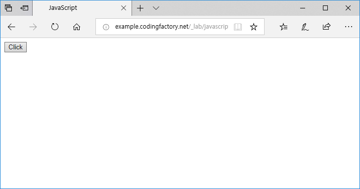

# 요소 추가하기 .createElement(), .createTextNode(), .appendChild()

자바스크립트를 이용하여 문서에 HTML 요소를 추가할 수 있습니다. 이 때 필요한 자바스크립트 속성은 다음과 같습니다.
  * .createElement()
  * .createTextNode()
  * .appendChild()
  <br>
.createElement()는 요소를 만듭니다. <br>
예를 들어.createElement( 'h1' )은 다음과 같은 코드를 생성합니다.

```
<h1></h1>
```

.createTextNode()는 선택한 요소에 텍스트를 추가합니다. <br>
예를 들어 .createTextNode( 'My Text' )는 My Text라는 문자열을 만듭니다. <br> <br>

.appendChild()는 선택한 요소 안에 자식 요소를 추가합니다. <br>
다음은 Click이라는 텍스트를 가진 button 요소를 추가하는 예제입니다.


```
<!doctype html>
<html lang="ko">
  <head>
    <meta charset="utf-8">
    <title>JavaScript</title>
  </head>
  <body>
    <script>
      var jbBtn = document.createElement( 'button' );
      var jbBtnText = document.createTextNode( 'Click' );
      jbBtn.appendChild( jbBtnText );
      document.body.appendChild( jbBtn );
    </script>
  </body>
</html>
```
 <br>

각 줄의 의미는 다음과 같습니다. <br><br>
var jbBtn = document.createElement( 'button' ); <br>
button 요소를 만들고 jbBtn에 저장합니다. <br><br>
var jbBtnText = document.createTextNode( 'Click' ); <br>
Click이라는 텍스트를 만들고 jbBtnText에 저장합니다. <br><br>
jbBtn.appendChild( jbBtnText ); <br>
jbBtn에 jbBtnText를 넣습니다. <br><br>
document.body.appendChild( jbBtn ); <br>
jbBtn을 body의 자식 요소로 넣습니다. 
